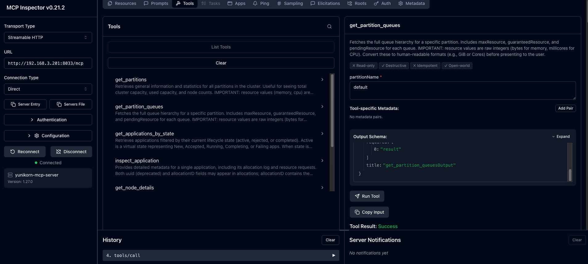
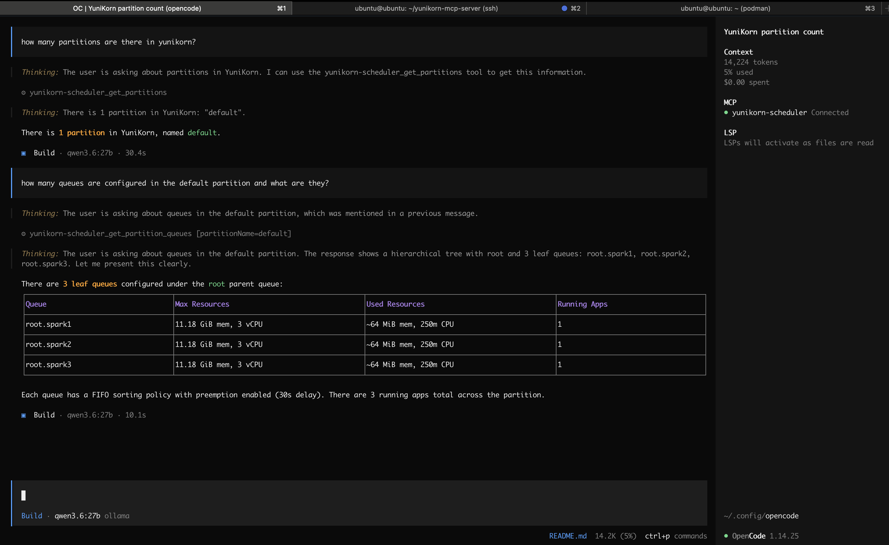

# YuniKorn MCP Server

A Model Context Protocol (MCP) server that interfaces with the Apache YuniKorn Scheduler, allowing AI agents to observe and reason about Kubernetes batch workload resource management, queue hierarchies, and application states.

## Screenshots
Inspecting Yunikorn tools using [MCP inspector](https://modelcontextprotocol.io/docs/tools/inspector)


Querying the Yunikorn scheduler via MCP using [Opencode](https://opencode.ai/)


## Features

- **7 MCP Tools**: Query partitions, queues, applications, nodes, user usage, and scheduler health
- **2 MCP Resources**: Static data access for partitions list and node utilization
- **Async HTTP**: Non-blocking API calls using `httpx`
- **Proper Error Mapping**: YuniKorn HTTP errors mapped to standard MCP error responses
- **Resource Awareness**: Handles YuniKorn's raw bytes and millicore values
- **CORS Enabled**: Allows connections from any origin for browser-based MCP Inspector
- **Streamable HTTP**: Default transport with stdio fallback for IDE integration
- **Authentication**: Optional bearer token, HTTP Basic auth, and mTLS client certificates — no auth required by default

## Installation

```bash
uv pip install -r requirements.txt
```

If you are using a virtual environment, make sure it is activated first:

```bash
source .venv/bin/activate
uv pip install -r requirements.txt
```

## Usage

### Running the Server

The default transport is **Streamable HTTP** on port 8000:

#### Run locally
```bash
uv run python -m main
```
#### Run with Docker
```bash
docker run -p 8000:8000 -e YUNIKORN_BASE_URL="http://<REPLACE_ME>/ws/v1" docker.io/frenoid/yunikorn-mcp-server:latest
```

#### Command line options

| Option | Description | Default |
|--------|-------------|---------|
| `--transport` | Transport protocol (`stdio`, `streamable-http`) | `streamable-http` |
| `--host` | Host to bind (HTTP transport only) | `0.0.0.0` |
| `--port` | Port to listen on (HTTP transport only) | `8000` |
| `--log-level` | Logging level | `INFO` |

Examples:

```bash
# Streamable HTTP on custom port
uv run python -m main --transport streamable-http --host 127.0.0.1 --port 8080

# Stdio mode for Claude Code / IDE integration
uv run python -m main --transport stdio
```

### Environment Variables

#### Connection

| Variable | Description | Default |
|----------|-------------|---------|
| `YUNIKORN_BASE_URL` | Base URL of the YuniKorn REST API | `http://localhost:9089/ws/v1/` |
| `TLS_INSECURE` | Disable HTTPS certificate verification (`true`/`false`) | `false` |

#### Authentication

Authentication is optional. If none of the variables below are set, the server connects without credentials (the original default behaviour).

| Variable | Description | Default |
|----------|-------------|---------|
| `YUNIKORN_TOKEN` | Bearer token — takes priority over Basic auth when both are set | *(none)* |
| `YUNIKORN_USERNAME` | Username for HTTP Basic auth | *(none)* |
| `YUNIKORN_PASSWORD` | Password for HTTP Basic auth | *(none)* |
| `YUNIKORN_CERT_PATH` | Path to client certificate file for mTLS | *(none)* |
| `YUNIKORN_KEY_PATH` | Path to client private key file for mTLS | *(none)* |

Auth priority (first match wins):

```
YUNIKORN_TOKEN set?                  → Bearer token
YUNIKORN_USERNAME + PASSWORD set?    → HTTP Basic auth
Neither set?                         → No auth (plain requests)

YUNIKORN_CERT_PATH + KEY_PATH set?   → mTLS (independent of the above)
```

The active auth method is logged at startup:

```
Authentication: None
Authentication: Bearer token (YUNIKORN_TOKEN)
Authentication: Basic auth (YUNIKORN_USERNAME=admin)
```

#### CORS

| Variable | Description | Default |
|----------|-------------|---------|
| `CORS_ALLOWED_ORIGINS` | Comma-separated list of allowed origins | `*` |

```bash
# Connect to a remote YuniKorn instance
YUNIKORN_BASE_URL=http://yunikorn.example.com:9089/ws/v1/ uv run python -m main

# HTTPS with a self-signed certificate
YUNIKORN_BASE_URL=https://yunikorn.example.com:9089/ws/v1/ TLS_INSECURE=true uv run python -m main

# Bearer token authentication
YUNIKORN_TOKEN=eyJhbGc... uv run python -m main

# HTTP Basic auth
YUNIKORN_USERNAME=admin YUNIKORN_PASSWORD=secret uv run python -m main

# mTLS client certificate
YUNIKORN_CERT_PATH=/path/to/client.crt YUNIKORN_KEY_PATH=/path/to/client.key uv run python -m main

# mTLS combined with bearer token
YUNIKORN_TOKEN=eyJhbGc... YUNIKORN_CERT_PATH=/path/to/client.crt YUNIKORN_KEY_PATH=/path/to/client.key uv run python -m main
```

### Connecting with MCP Inspector

The Streamable HTTP endpoint is exposed at the `/mcp` path:

```
http://localhost:8000/mcp
```

## Testing

### Offline unit tests (no YuniKorn instance needed)

Covers HTTP error mapping, input validation, network error propagation, and auth configuration:

```bash
uv pip install -e ".[dev]"
pytest test_error_paths.py -v
```

### Integration tests (requires a live YuniKorn instance)

Run the full test suite against a real cluster:

```bash
YUNIKORN_BASE_URL=http://your-yunikorn-host:9089/ws/v1/ uv run python test_server.py
```

Quick compliance check for the `get_applications_by_state` optional `status` parameter:

```bash
YUNIKORN_BASE_URL=http://your-yunikorn-host:9089/ws/v1/ uv run python test_updated_server.py
```

### Data Format Notes

- **Memory**: Represented in raw bytes (64-bit signed integers).
- **CPU (vcore)**: Represented in millicores (thousandths of a core, i.e. 1000m = 1 core).
- **Other resources**: No specific unit assigned.
- **Active applications**: The virtual "active" state represents New, Accepted, Running, Completing, and Failing statuses.
- **allocationID vs uuid**: `uuid` is deprecated. `allocationID` contains the same base value as `uuid` with a hyphen-counter suffix (e.g., `-0`, `-1`).
- **allocationDelay**: The difference between `allocationTime` and `requestTime` for an allocation.

## API Conformance

This MCP server conforms to the [Apache YuniKorn Scheduler REST API](https://yunikorn.apache.org/docs/api/scheduler/) (v1.8.0). Each tool maps directly to a documented endpoint.

| Tool | YuniKorn Endpoint |
|------|-------------------|
| `get_partitions` | `GET /ws/v1/partitions` |
| `get_partition_queues` | `GET /ws/v1/partition/{partitionName}/queues` |
| `get_applications_by_state` | `GET /ws/v1/partition/{partitionName}/applications/{state}?status={status}` |
| `inspect_application` | `GET /ws/v1/partition/{partitionName}/application/{appId}` |
| `get_node_details` | `GET /ws/v1/partition/{partitionName}/nodes` or `/node/{nodeId}` |
| `get_user_usage` | `GET /ws/v1/partition/{partitionName}/usage/users` or `/usage/user/{userName}` |
| `check_scheduler_health` | `GET /ws/v1/scheduler/healthcheck` |

**Resources:**

| Resource | YuniKorn Endpoint |
|----------|-------------------|
| `yunikorn://partitions/list` | `GET /ws/v1/partitions` |
| `yunikorn://nodes/utilization` | `GET /ws/v1/scheduler/node-utilizations` |

## Error Mapping

| YuniKorn HTTP Code | MCP Error | Notes |
|--------------------|-----------|-------|
| `400 Bad Request` | `INVALID_REQUEST` | Invalid parameter or malformed query |
| `404 Not Found` | `INVALID_REQUEST` | Partition, queue, app, or node does not exist |
| `500+ Internal Server Error` | `INTERNAL_ERROR` | Scheduler-side failure |
| `401 Unauthorized` | `INTERNAL_ERROR` | Check authentication configuration |
| `403 Forbidden` | `INTERNAL_ERROR` | Credentials lack required permissions |
| `429 Too Many Requests` | `INTERNAL_ERROR` | YuniKorn rate limit reached |
| Other 4xx / 5xx | `INTERNAL_ERROR` | HTTP status code included in the error message |

Input validation errors (invalid `state` or `status` values) are caught before the HTTP call and returned as `INVALID_REQUEST` immediately.
